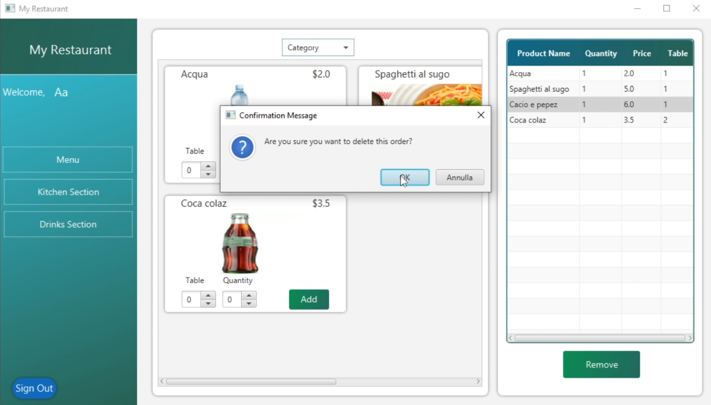
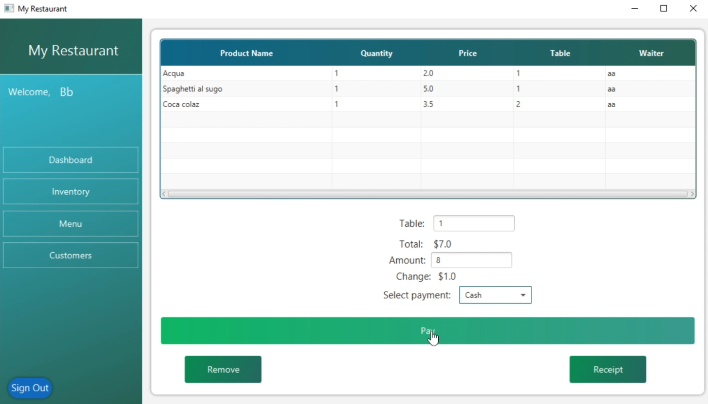

# Gestionale Ristorante - Progetto JavaFX

Questo progetto è stato realizzato come parte dell’esame di Programmazione III presso l'Università Parthenope. Si tratta di un gestionale per ristoranti sviluppato in Java con interfaccia grafica JavaFX e connessione a database MySQL.

## 🎯 Funzionalità principali

- Gestione clienti, ordini, tavoli e prodotti
- Interfaccia grafica realizzata con Scene Builder
- Persistenza dei dati tramite MySQL
- Calcolo totale, sconti e visualizzazione ordini
- Supporto per più livelli di accesso (Admin e Cameriere)

## 🧠 Design Pattern Utilizzati

- Strategy
- Command
- Prototype
- Chain of Responsibility

## 🗃️ Struttura del progetto

- `src/` → Codice sorgente Java
- `MyRestaurant.sql` → Script SQL per creare il database
- `Relazione.pdf` e `Presentazione.pptx` → Documentazione del progetto
- `MyRestaurant.mp4` → Video dimostrativo del gestionale in esecuzione
- `diagramma_classi/` → Diagrammi UML delle classi principali

## 👥 Team

- Fabio Salese  
- Crescenzo Cerqua

Nel progetto mi sono occupato di:
- Logica degli ordini
- Collegamento con MySQL
- Implementazione dei pattern Strategy e Command
- Gestione delle classi `Ordine`, `Prodotto` e `Conto`

## 🛠️ Tecnologie

- Java 17
- JavaFX
- Scene Builder
- MySQL
- JDBC

## 📸 Screenshot dell'applicazione

### 👨‍🍳 Schermata del Cameriere  
Il cameriere può selezionare i prodotti da servire, specificare il tavolo e la quantità, e aggiungere gli ordini. È anche possibile eliminare un ordine cliccando sul pulsante “Remove”, previa conferma tramite pop-up.  

### 👨‍💼 Schermata dell’Amministratore  
L’amministratore può visualizzare il riepilogo dell’ordine, calcolare il totale e il resto, selezionare il metodo di pagamento e finalizzare la transazione.  

---

